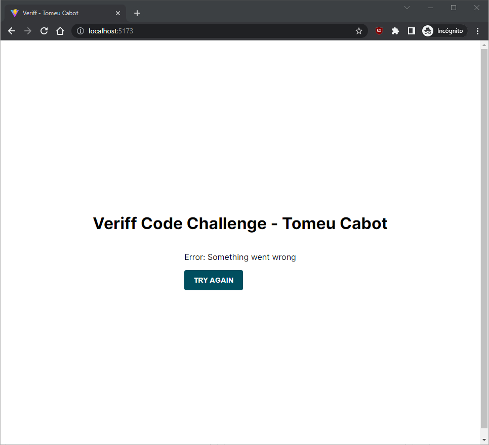
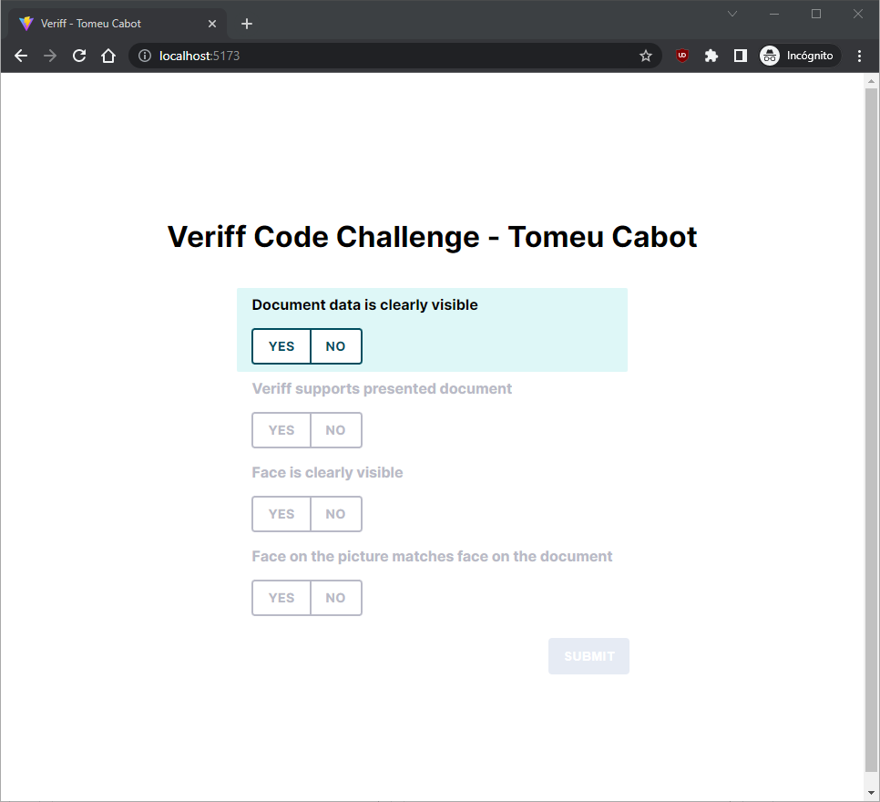
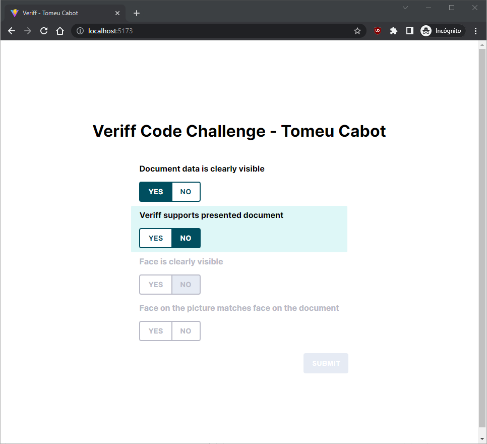
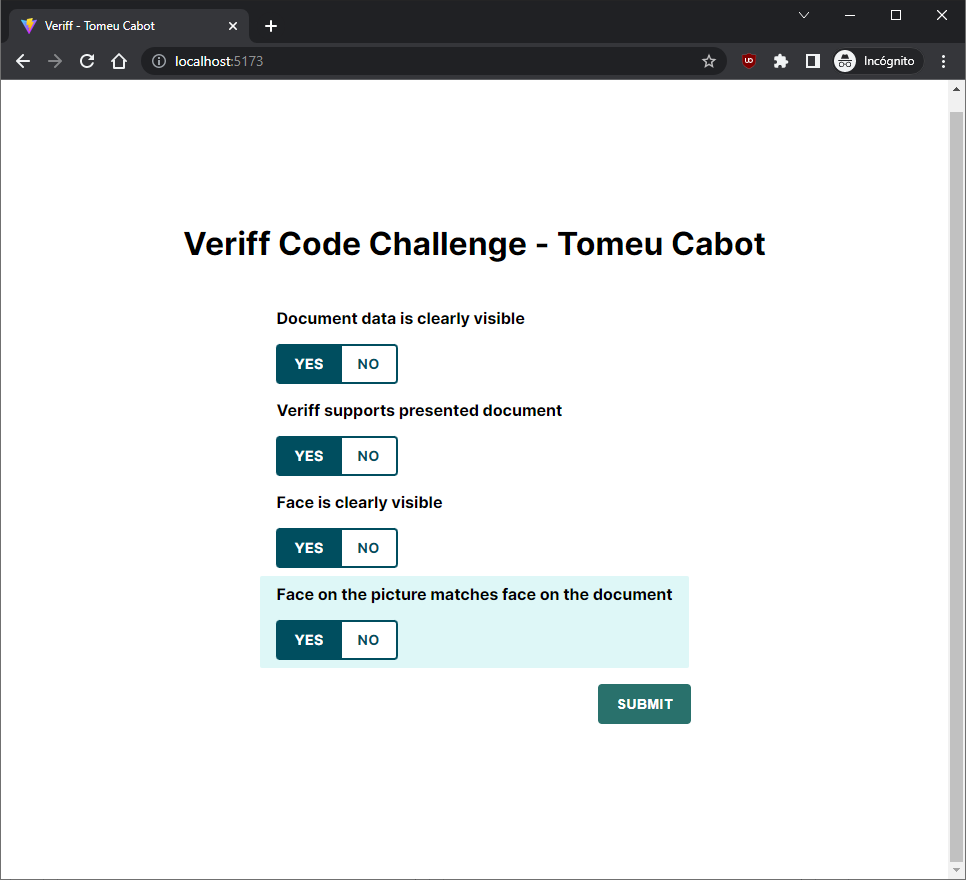

# veriff.com - Frontend Interview

> URL preview: https://tc-veriff-frontend-challenge.netlify.app/

## Get Started

### 📚 Install dependencies

```bash
$ npm install
```

### 🚀 Run the app!

```bash
$ npm dev
```

### 🛠 Tools

- [React](https://reactjs.org/)
- [Typescript](https://www.typescriptlang.org/)
- [Vite](https://vitejs.dev/)
- [Vitest](https://vitest.dev/)
- [Testing Library](https://testing-library.com/)

### 📸 Screenshots

|                                             |                                             |
| ------------------------------------------- | ------------------------------------------- |
|  |  |
|            |         |

### 🧪 Test coverage

```
--------------------------------|---------|----------|---------|---------|-------------------
File                            | % Stmts | % Branch | % Funcs | % Lines | Uncovered Line #s
--------------------------------|---------|----------|---------|---------|-------------------
All files                       |   99.17 |    96.92 |   96.55 |   99.17 |
 src                            |     100 |      100 |     100 |     100 |
  setupTests.ts                 |     100 |      100 |     100 |     100 |
 src/components/Button          |     100 |      100 |     100 |     100 |
  Button.tsx                    |     100 |      100 |     100 |     100 |
  index.ts                      |     100 |      100 |     100 |     100 |
 src/components/Check           |     100 |      100 |     100 |     100 |
  Check.tsx                     |     100 |      100 |     100 |     100 |
  index.ts                      |     100 |      100 |     100 |     100 |
 src/components/CheckCompilance |   98.08 |    94.28 |    90.9 |   98.08 |
  CheckCompilance.tsx           |   98.33 |    96.29 |    87.5 |   98.33 | 68-69
  reducer.ts                    |   97.29 |     87.5 |     100 |   97.29 | 35
 src/components/ErrorMessage    |     100 |      100 |     100 |     100 |
  ErrorMessage.tsx              |     100 |      100 |     100 |     100 |
  index.ts                      |     100 |      100 |     100 |     100 |
 src/components/ToggleButton    |     100 |      100 |     100 |     100 |
  ToggleButton.tsx              |     100 |      100 |     100 |     100 |
  index.ts                      |     100 |      100 |     100 |     100 |
 src/hooks                      |     100 |      100 |     100 |     100 |
  useKeyEvents.ts               |     100 |      100 |     100 |     100 |
 src/types                      |     100 |      100 |     100 |     100 |
  index.ts                      |     100 |      100 |     100 |     100 |
--------------------------------|---------|----------|---------|---------|-------------------
```
